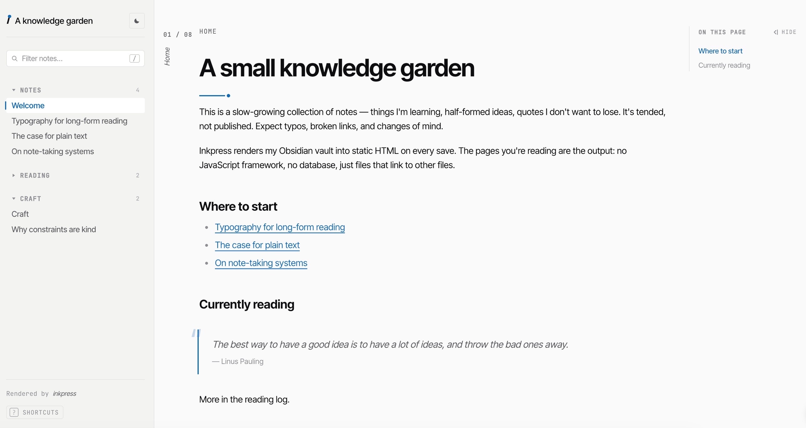

[English](./README.md) | 简体中文

# inkpress-renderer

将 Obsidian 知识库文件夹渲染为静态 HTML 站点，使用偏文学、阅读优先的默认主题。



## 默认主题

以阅读为中心的版式：侧栏导航、面包屑、TOC、反向链接、暗色模式，按 `?` 唤出快捷键面板。三种 variant ——  `technical`（默认）、`editorial`、`manuscript`，各自配 light + dark。

在渲染时选择 variant：

```ts
await renderSite({ ...options, variant: 'editorial' })
```

## 安装

```bash
pnpm add inkpress-renderer
```

## 基本用法

```ts
import { renderSite, DefaultTheme, FileSystemAdapter } from 'inkpress-renderer'

const adapter = new FileSystemAdapter('/path/to/vault')

const result = await renderSite({
  adapter,
  theme: DefaultTheme,
  publishDirs: ['Notes', 'Blog'],
  siteTitle: 'My Site',
})

console.log(result.pages)   // rendered HTML pages
console.log(result.assets)  // theme assets to copy
```

## 核心接口

### RenderOptions

| 字段 | 类型 | 说明 |
|------|------|------|
| `adapter` | `FileSystemAdapter` | 提供对知识库文件的访问 |
| `theme` | `Theme` | 主题对象（使用 `DefaultTheme`） |
| `publishDirs` | `string[]` | 需要发布的知识库文件夹 |
| `siteTitle` | `string` | 显示在导航栏中的站点标题 |
| `baseUrl` | `string?` | 可选的基础 URL 前缀 |

### RenderResult

| 字段 | 类型 | 说明 |
|------|------|------|
| `pages` | `RenderedPage[]` | 渲染后的 HTML 页面数组 |
| `assets` | `ThemeAsset[]` | 主题所需的静态资源 |
| `siteJson` | `object` | 站点元数据（见下文） |

## site.json

每次渲染都会生成一个 `site.json` 清单文件，描述页面树、导航结构和元数据。该文件面向未来扩展，例如搜索索引、增量重建和 CI 差异对比。

## Inkpress 生态

- **obsidian-inkpress** — 一键发布到阿里云 OSS 的 Obsidian 插件：[fangbinwei/obsidian-inkpress](https://github.com/fangbinwei/obsidian-inkpress)
- **inkpress-render-action** — 基于 CI 发布的 GitHub Action：[fangbinwei/inkpress-render-action](https://github.com/fangbinwei/inkpress-render-action)
